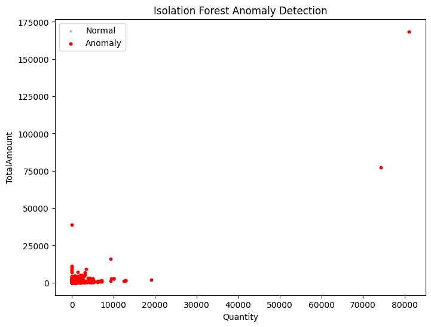
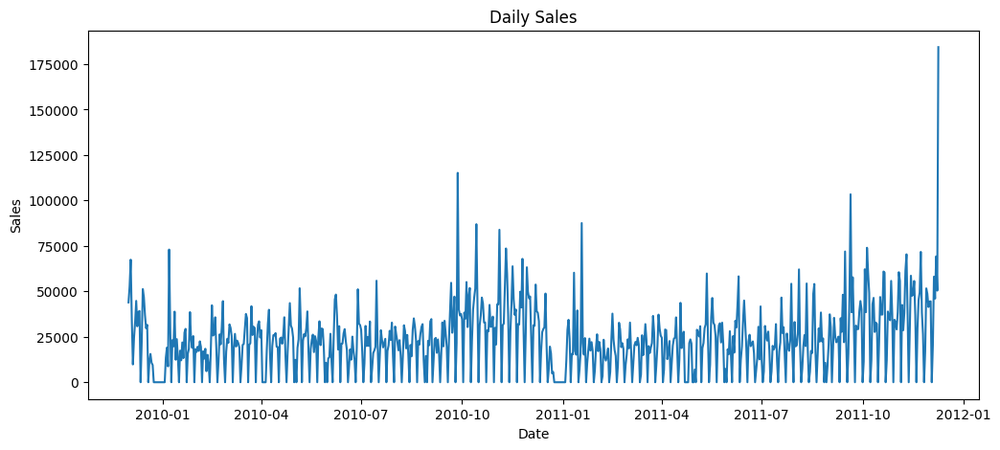
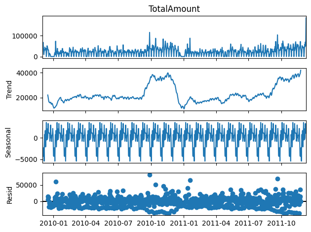
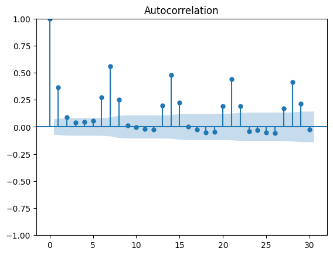
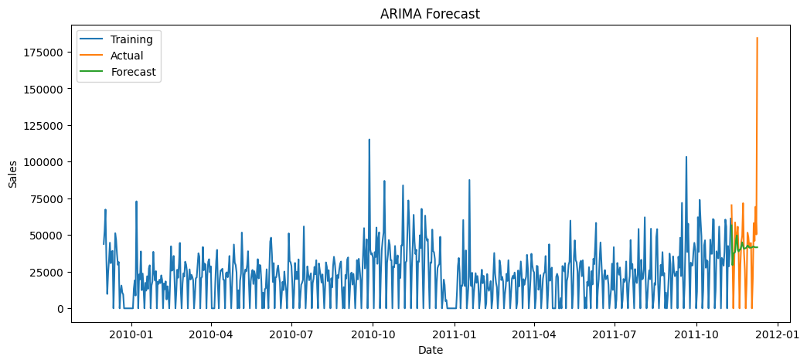
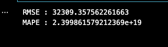

# Member 4 – Anomaly Detection & Demand Forecasting

> AI/ML Internship Industry Mini Project  
> Module: Anomaly Detection & Demand Forecasting

---

## Project Overview

This module focuses on identifying unusual retail transactions using **Isolation Forest** and forecasting future retail sales using **Time Series Analysis**. The objective is to detect abnormal purchasing behavior and predict future sales trends for better business decision-making.

---

## Folder Structure

```text
member4/
│
├── notebooks/
│   ├── anomaly_detection.ipynb
│   └── demand_forecasting.ipynb
│
├── results/
│   ├── anomaly_detection.png
│   ├── anomaly_summary.png
│   ├── daily_sales.png
│   ├── time_series_decomposition.png
│   ├── acf_plot.png
│   ├── arima_forecast.png
│   └── evaluation_metrics.png
│
├── README.md
└── requirements.txt
```

---

## Dataset

| Property | Value |
|----------|-------|
| Dataset | Cleaned Retail Dataset |
| Source | Member 1 Preprocessed Data |
| Records | 779,425 |
| Features | 9 |

### Dataset Columns

- Invoice
- StockCode
- Description
- Quantity
- InvoiceDate
- Price
- Customer ID
- Country
- TotalAmount

---

## Tasks Performed

### Anomaly Detection

- Isolation Forest
- Top 1% Anomaly Detection
- Transaction Analysis
- Anomaly Visualization

### Demand Forecasting

- Daily Sales Resampling
- Trend Analysis
- Seasonality Analysis
- Residual Analysis
- ACF Plot
- ARIMA Forecasting
- RMSE Calculation
- MAPE Calculation

---

## Technologies Used

- Python
- Pandas
- NumPy
- Matplotlib
- Scikit-learn
- Statsmodels
- Prophet

---

## Results

The model successfully:

- Identified abnormal retail transactions using Isolation Forest.
- Detected approximately **1% anomalous transactions**.
- Generated daily sales trends.
- Performed time series decomposition.
- Forecasted future sales using the ARIMA model.
- Evaluated forecasting performance using RMSE and MAPE.

---

## Screenshots

### 1. Anomaly Detection



---

### 2. Daily Sales Trend



---

### 3. Time Series Decomposition



---

### 4. ACF Plot



---

### 5. ARIMA Forecast



---

### 6. Evaluation Metrics



---

## Team Member

- Ramya
